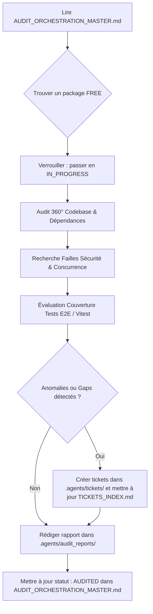

# Skill : Audit 360° & Système de Tickets (OmniAntigravity Remote Chat)

Ce skill formalise la méthodologie d'évaluation 360°, la grille d'analyse multi-dimensionnelle et le protocole de billetterie (tickets d'anomalies et d'améliorations) adaptés à l'écosystème **OmniAntigravityRemoteChat**.

---

## 🎯 Objectif du Skill

Permettre à l'agent (ou à une escouade de sous-agents parallèles) de :
1. **Auditer exhaustivement** n'importe quel sous-système de l'application (serveur Express, bus WebSocket, pont Chrome DevTools Protocol, interface mobile PWA, outils système workspace, agent superviseur, bot Telegram).
2. **Identifier les défauts critiques** : failles de sécurité, vulnérabilités d'authentification (bypass LAN), conditions de concurrence (`send-lock`), blocages de l'éditeur Lexical, processus orphelins (zombies), fuites mémoire et défauts d'accessibilité mobile (A11y).
3. **Générer des tickets normalisés** dans `.agents/tickets/` avec preuves de code, classification de sévérité (P0 à P3) et scénarios de test E2E de reproduction.
4. **Mettre à jour l'index central** `.agents/tickets/TICKETS_INDEX.md` et le registre d'orchestration `AUDIT_ORCHESTRATION_MASTER.md`.
5. **Rédiger des rapports de domaine 360°** structurés dans `.agents/audit_reports/`.

---

## 🧭 Procédure Opératoire Standard (SOP) pour les Agents d'Audit

Lorsqu'un agent prend en charge un domaine d'audit :



### 1. Verrouillage Atomique du Domaine
1. Consulter le tableau de bord dans `AUDIT_ORCHESTRATION_MASTER.md`.
2. Repérer un package dont le statut est `FREE`.
3. Remplacer immédiatement son statut par `🔄 IN_PROGRESS`, inscrire son identifiant d'agent et l'horodatage.

### 2. Grille d'Évaluation 360°
Chaque domaine doit être inspecté sous 6 axes :
1. **Architecture & Logique Métier** : Intégrité des flux d'états, machines à états, typage JSDoc (`@ts-check`), cohérence des réponses JSON.
2. **Sécurité, Contrôle d'Accès & Réseau** : Validation des cookies signés, étanchéité de `isLocalRequest`, politique CSP, protection contre les traversées de répertoire (`fs.realpath`), injection de commandes shell.
3. **Concurrence, Résilience & Verrous** : Atomicité des promesses (`withSendLock`), déduplication SHA-256 des messages, réentrance des actions, gestion du cycle de reconnexion WebSocket/CDP.
4. **Frontend Mobile & Ergonomie (A11y / PWA)** : Gestion du viewport tactile, prévention du zoom automatique (`touch-action`), focus-trap dans les tiroirs/modales, support offline du service worker (`sw.js`).
5. **Gestion des Erreurs & Observabilité** : Codes HTTP explicites (400, 401, 403, 404, 409, 503), aucune exception non interceptée dans les promesses, métriques session (`session-stats.js`).
6. **Complétude des Tests E2E & Unitaires** : Identification des cas limites non testés, formalisation d'un scénario Playwright / Vitest simulé.

### 3. Création des Tickets d'Anomalie
Chaque ticket créé doit respecter :
- Nom de fichier : `.agents/tickets/TICKET-[DOMXX]-[YYY]-[slug-court].md` (Ex: `TICKET-DOM06-001-lan-auth-bypass-ip-cidr.md`)
- Remplissage de tous les champs obligatoires du modèle `TICKET_TEMPLATE.md` :
  - **ID Ticket** : `TICKET-DOMXX-YYY`
  - **Sévérité** : `P0 (Bloquant/Sécurité)` / `P1 (Majeur/Bogue)` / `P2 (Normal/E2E Gap)` / `P3 (Mineur/Polish)`
  - **Catégorie** : `SECURITY`, `BUG`, `CONCURRENCY`, `E2E_GAP`, `A11Y`, `PERF`, `TECH_DEBT`
  - **Preuve & Extrait de Code** : Code réel exact avec chemin et lignes.
  - **Plan de Correction Prescrit** : Démarche concrète de résolution.
  - **Stratégie E2E / Automatisation** : Test de non-régression à concevoir.

---

## 📊 Typologie des Sévérités

| Sévérité | Définition | Délai de Traitement |
|---|---|---|
| **P0** | Faille de sécurité critique (bypass auth, exécution de code non restreinte, fuite de jeton), blocage complet de la communication CDP ou crash serveur systématique. | Immédiat |
| **P1** | Bogue fonctionnel majeur, corruption de message, désynchronisation d'état mobile/CDP, fuite de sous-processus zombies, absence de gestion d'erreur sur route critique. | Prioritaire |
| **P2** | Lacune de test E2E sur parcours utilisateur clé, régression partielle de fonctionnalité secondaire, défaut d'accessibilité modale / tactile. | Sprint normal |
| **P3** | Dette technique, refactorisation mineure, optimisation de style CSS, nettoyage de logs superflus. | Secondaire |

---

## 🛠️ Commandes Utiles pour l'Agent

```bash
# Vérification de la suite de tests unitaires
npm run test:unit

# Lancement des smoke tests d'intégration
npm test

# Analyse des routes et contrôleurs
grep -n "app.post(" src/server.js
grep -n "app.get(" src/server.js

# Recherche de failles potentielles de sécurité
grep -rn "exec(" src/
grep -rn "spawn(" src/
grep -rn "eval(" src/
```
