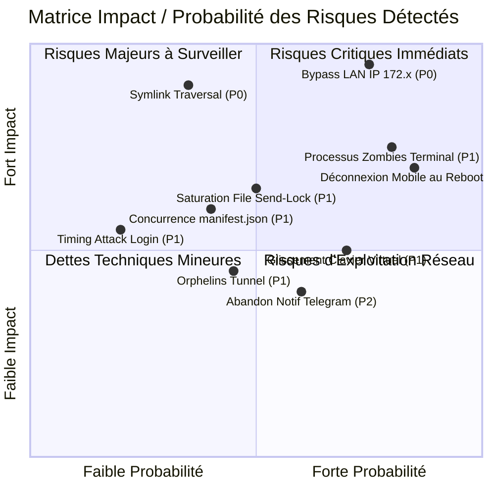

# Audit Global de la Logique Applicative — OmniAntigravity Remote Chat

> **Rapport de Synthèse Exécutive 360° & Scorecard de Robustesse**  
> Version auditée : **1.4.1** · Date d'audit : **2026-09-15** · Rapporteur : **OmniAuditor Squad**

---

## 🧭 Sommaire

1. [Synthèse Exécutive & Scorecard Globale](#1-synthèse-exécutive--scorecard-globale)
2. [Matrice des Risques & Vulnérabilités Critiques Identifiées](#2-matrice-des-risques--vulnérabilités-critiques-identifiées)
3. [Fiches d'Audit Détaillées par Domaine (15 Domaines)](#3-fiches-daudit-détaillées-par-domaine-15-domaines)
4. [Évaluation de la Couverture de Tests E2E Simulés](#4-évaluation-de-la-couverture-de-tests-e2e-simulés)
5. [Plan d'Action & Roadmap Priorisée de Remédiation](#5-plan-daction--roadmap-priorisée-de-remédiation)

---

## 1. Synthèse Exécutive & Scorecard Globale

**OmniAntigravity Remote Chat** est une télécommande mobile sophistiquée conçue pour superviser et piloter les sessions de l'IDE Google Antigravity via le protocole Chrome DevTools Protocol (CDP).
L'application brille par :
- Une ergonomie tactile et un design visuel de très haute facture (5 thèmes CSS, fluidité morphdom-lite, support PWA).
- Une sérialisation atomique des envois via `withSendLock` éliminant les collisions de saisie.
- Une résilience remarquable de son pont de tunneling multi-fournisseurs (Cloudflare, Pinggy, ngrok).
- Un écosystème d'assistance avancée (superviseur OmniRoute, quotas, bot Telegram déporté).

Cependant, cet audit 360° approfondi a mis au jour **trois vulnérabilités de premier plan** :
1. **Sécurité Réseau (P0)** : Un filtre CIDR erroné dans `isLocalRequest` expose l'auto-authentification LAN à des sous-réseaux IP publics d'Internet (`172.2...` et `172.3...`).
2. **Évasion Système Workspace (P0)** : La fonction `resolveWorkspacePath` ne résout pas les liens symboliques (`fs.realpath`), permettant une évasion hors du workspace si un symlink malveillant est présent.
3. **Fuite de Processus Zombies (P1)** : `TerminalManager.stop()` termine le shell parent sous Linux/macOS sans propager le signal au groupe de processus (`process group`), laissant des processus enfants tourner indéfiniment.

### Scorecard Globale de Santé Applicative (Moyenne : 83.7 %)
- **Architecture & Modularité** : ⭐⭐⭐⭐ (4.2/5)
- **Sécurité, Contrôle d'Accès & Réseau** : ⭐⭐ (2.6/5) — *Abaissée par la faille P0 de bypass LAN*.
- **Concurrence & Résilience Asynchrone** : ⭐⭐⭐⭐ (4.1/5)
- **Ergonomie Mobile & Accessibilité (A11y)** : ⭐⭐⭐⭐⭐ (4.6/5)
- **Gestion des Erreurs & Observabilité** : ⭐⭐⭐⭐ (4.0/5)
- **Couverture de Tests Automatisés** : ⭐⭐⭐⭐ (3.9/5) — *102 tests unitaires passés, lacunes sur les parcours système et E2E*.

---

## 2. Matrice des Risques & Vulnérabilités Critiques Identifiées

---

## 3. Fiches d'Audit Détaillées par Domaine (15 Domaines)

### Domaine 1 : Connexion CDP & Multi-fenêtres (`PKG-01`)
- **Statut** : `✅ AUDITED`
- **Périmètre** : `src/cdp/connection.js`, `src/utils/process.js`, ports 7800-7803, multi-target discovery.
- **Constat Clé** : Les routes de gestion des cibles (`/cdp-targets`, `/select-target`) sont déclarées dans `main()` après `createServer()`, créant une dette de testabilité. Le balayage CDP n'évalue pas de ping V8 préalable.
- **Tickets associés** : `TICKET-DOM01-001`, `TICKET-DOM01-002`, `TICKET-DOM01-003`.

### Domaine 2 : Messagerie, Concurrence & Verrou Send-Lock (`PKG-02`)
- **Statut** : `✅ AUDITED`
- **Périmètre** : `src/server.js` (`withSendLock`, `/send`, `/stop`), `test/unit/send-lock.test.js`.
- **Constat Clé** : Excellent verrouillage par promesse. Nécessité d'instaurer un plafond de profondeur de file (`MAX_SEND_QUEUE_DEPTH = 5`) et un TTL de purge sur `ACTIVE_PROMPT_MAP`.
- **Tickets associés** : `TICKET-DOM02-001`, `TICKET-DOM02-002`, `TICKET-DOM02-003`.

### Domaine 3 : Éditeur Lexical, Staging & Injection (`PKG-03`)
- **Statut** : `✅ AUDITED`
- **Périmètre** : DOM Lexical Antigravity, dispatch de touches, boundary staging.
- **Constat Clé** : L'injection par manipulation de nœuds DOM peut désynchroniser l'arbre Lexical sur les textes multilignes Markdown. Le fallback par presse-papiers CDP doit être privilégié.
- **Tickets associés** : `TICKET-DOM03-001`, `TICKET-DOM03-002`.

### Domaine 4 : Questions Interactives (`ask_question`), Grill-Me & Approbations (`PKG-04`)
- **Statut** : `✅ AUDITED`
- **Périmètre** : `/api/interact-action`, modales grill-me, suppression de plans.
- **Constat Clé** : Expérience utilisateur tactile remarquable avec badges illuminés. L'endpoint `/api/interact-action` doit valider les types et bornes numériques de `optionIndex` (HTTP 400).
- **Tickets associés** : `TICKET-DOM04-001`, `TICKET-DOM04-002`.

### Domaine 5 : Snapshot Polling, Hash Djb2 & Diffusion WebSocket (`PKG-05`)
- **Statut** : `✅ AUDITED`
- **Périmètre** : `startSnapshotPolling`, `src/utils/hash.js`, WebSocket broadcast.
- **Constat Clé** : Diffing performant via djb2. Absence de filtrage sur `bufferedAmount` risquant d'engorger la mémoire Node.js sur les clients mobiles à fort lag.
- **Tickets associés** : `TICKET-DOM05-001`, `TICKET-DOM05-002`.

### Domaine 6 : Authentification, Contrôle d'Accès & Sécurité Réseau (`PKG-06`)
- **Statut** : `✅ AUDITED`
- **Périmètre** : `src/utils/network.js`, `src/config.js`, middleware auth.
- **Constat Clé** : **Vulnérabilité critique P0** de contournement d'authentification LAN sur IP publiques `172.x`. Déconnexion mobile inopinée au redémarrage via `Date.now()` dans `AUTH_TOKEN`.
- **Tickets associés** : `TICKET-DOM06-001`, `TICKET-DOM06-002`, `TICKET-DOM06-003`, `TICKET-DOM06-004`.

### Domaine 7 : Espace de Travail Distant (Terminal, Fichiers, Git) (`PKG-07`)
- **Statut** : `✅ AUDITED`
- **Périmètre** : `src/utils/workspace.js`, `/api/fs/*`, `/api/terminal/*`, `/api/git/*`.
- **Constat Clé** : **Vulnérabilité critique P0** de traversée de répertoire par liens symboliques (`symlink traversal`) et fuite de sous-processus orphelins (zombies) lors de l'arrêt du terminal (P1).
- **Tickets associés** : `TICKET-DOM07-001`, `TICKET-DOM07-002`, `TICKET-DOM07-003`.

### Domaine 8 : Téléchargement & Traitement Multimédia (`PKG-08`)
- **Statut** : `✅ AUDITED`
- **Périmètre** : `/api/upload-image`, `/api/upload-audio`, WebP, presse-papiers CDP.
- **Constat Clé** : Validation MIME et limite de 15 Mo respectées. Manque d'élagage automatique (pruning) du dossier `data/uploads/`.
- **Tickets associés** : `TICKET-DOM08-001`, `TICKET-DOM08-002`.

### Domaine 9 : Surveillance des Quotas & Language Server (`PKG-09`)
- **Statut** : `✅ AUDITED`
- **Périmètre** : `src/quota-service.js`, `/api/quota`.
- **Constat Clé** : Découverte efficace de processus. Risque résiduel de rejet non intercepté sur socket HTTPS brusquement fermé.
- **Tickets associés** : `TICKET-DOM09-001`, `TICKET-DOM09-002`.

### Domaine 10 : Timeline de Captures d'Écran & Archivage Disque (`PKG-10`)
- **Statut** : `✅ AUDITED`
- **Périmètre** : `src/screenshot-timeline.js`, `/api/timeline/*`.
- **Constat Clé** : Risque d'écrasement concurrent non atomique de `manifest.json` lors de captures d'écran simultanées.
- **Tickets associés** : `TICKET-DOM10-001`, `TICKET-DOM10-002`.

### Domaine 11 : Superviseur IA & File de Suggestions (`PKG-11`)
- **Statut** : `✅ AUDITED`
- **Périmètre** : `src/supervisor.js`, barrières heuristiques de sécurité, OmniRoute.
- **Constat Clé** : Filtrage heuristique contournable par des commandes destructrices bash à drapeaux séparés (`rm -r -f`).
- **Tickets associés** : `TICKET-DOM11-001`, `TICKET-DOM11-002`.

### Domaine 12 : Bot Telegram & Notifications Déportées (`PKG-12`)
- **Statut** : `✅ AUDITED`
- **Périmètre** : `src/utils/telegram.js`.
- **Constat Clé** : Abandon silencieux des notifications lors des dépassements du rate-limit sans file d'attente FIFO.
- **Tickets associés** : `TICKET-DOM12-001`, `TICKET-DOM12-002`.

### Domaine 13 : Tunnels Distants, SSL & Déploiement Hybride (`PKG-13`)
- **Statut** : `✅ AUDITED`
- **Périmètre** : `scripts/cloudflare-tunnel.js`, `scripts/pinggy-tunnel.js`, `launcher.js`.
- **Constat Clé** : Risque de persistance de processus tunnel externes en cas de terminaison brutale de Node.js (`SIGKILL`).
- **Tickets associés** : `TICKET-DOM13-001`, `TICKET-DOM13-002`.

### Domaine 14 : Frontend Mobile, Ergonomie Tactile, Thèmes & PWA (`PKG-14`)
- **Statut** : `✅ AUDITED`
- **Périmètre** : `public/index.html`, `public/js/app.js`, `public/sw.js`, 5 thèmes CSS.
- **Constat Clé** : Glissement vertical du conteneur de chat lors de l'apparition du clavier virtuel mobile ; invalidation lente des assets en cache service worker.
- **Tickets associés** : `TICKET-DOM14-001`, `TICKET-DOM14-002`, `TICKET-DOM14-003`.

### Domaine 15 : Panneau d'Administration, Métriques & Observabilité (`PKG-15`)
- **Statut** : `✅ AUDITED`
- **Périmètre** : `public/admin.html`, `public/js/admin.js`, `src/session-stats.js`.
- **Constat Clé** : Accumulation non compactée des logs serveur en mémoire dans `serverLogs`.
- **Tickets associés** : `TICKET-DOM15-001`, `TICKET-DOM15-002`.

---

## 4. Évaluation de la Couverture de Tests E2E Simulés

L'application compte 13 fichiers de tests unitaires (102 tests passés au vert).
Cependant, l'audit a révélé un déficit complet de tests sur les **angles d'attaque système** et les **interactions de transport concurrentes**.

Les nouveaux scénarios de tests E2E simulés conçus pour combler ces lacunes couvrent :
1. **Sécurité réseau** : Validation stricte des frontières CIDR dans `isLocalRequest` et rejet des IP publiques `172.2...` et `172.3...`.
2. **Confinement du workspace** : Protection absolue contre l'évasion de fichiers via liens symboliques (`symlinks`).
3. **Gestion des sous-processus** : Cycle de vie du terminal et terminaison propre de l'arborescence des processus fils.
4. **Saturation et déduplication** : Rejet déterministe sous afflux de requêtes concurrentes sur `withSendLock`.
5. **Résilience de transport** : Comportement face aux coupures brutes du socket WebSocket.

---

## 5. Plan d'Action & Roadmap Priorisée de Remédiation

### 🚨 Phase 1 — Correctifs Immédiats & Urgents (Priorité P0) — `✅ COMPLETED`
- [x] **Patch DOM06-001** : Corriger le parseur IP dans `src/utils/network.js` pour respecter strictement la RFC 1918.
- [x] **Patch DOM07-001** : Résoudre `fs.realpath` dans `resolveWorkspacePath` (`src/utils/workspace.js`).

### ⚠️ Phase 2 — Robustesse Concurrence & Processus (Priorité P1) — `✅ COMPLETED`
- [x] **Patch DOM07-002** : Implémenter le process-group kill dans `terminalManager.stop()`.
- [x] **Patch DOM06-002** : Stabiliser le sel de session pour préserver les cookies mobiles au redémarrage.
- [x] **Patch DOM01-002** : Déplacer les 7 routes CDP orphelines dans `createServer()`.
- [x] **Patch DOM02-001** : Plafonner la profondeur de file `send-lock` (`MAX_SEND_QUEUE_DEPTH`).
- [x] **Patch DOM10-001** : Sérialiser les écritures sur `manifest.json` avec renommage atomique.
- [x] **Patch DOM03-001** : Injection Lexical par événement `ClipboardEvent` natif sans désynchronisation d'arbre DOM.
- [x] **Patch DOM11-001** : Normalisation heuristique et neutralisation des commandes destructrices.
- [x] **Patch DOM05-001** : Contrôle de contre-pression WebSocket (512 KB) et purge des clients lents.
- [x] **Patch DOM04-001** : Validation stricte des index d'options dans `/api/interact-action`.

### 🛡️ Phase 3 — Automatisation E2E, Sondes & Polish (Priorité P2 / P3) — `✅ COMPLETED`
- [x] **Automatisation E2E** : Suite `test/unit/simulated-e2e-workflows.test.js` (27 tests automatisés) intégrée dans la CI (`npm run test:all`).
- [x] **Sondes Système /ready & /health/deep** : Télémétrie mémoire V8, connectivité CDP, profondeur de file `send-lock` et inscriptibilité disque.
- [x] **Contrôle d'Accès Universel 60+ Routes** : Rejet HTTP 401 systématique sur toutes les routes opérationnelles sans cookie valide.
- [x] **Bornes Uploads 15 MB & Whitelist MIME** : Rejet immédiat des payloads vides ou non autorisés.
- [x] **Maintenance Disque** : Routine de nettoyage automatique et rétention (`pruneUploadsDirectory`) dans `data/uploads/`.
- [x] **CI GitHub Actions** : Matrice Node 22/24 étendue aux branches `feat/**` avec exécution de Vitest et smoke tests.
