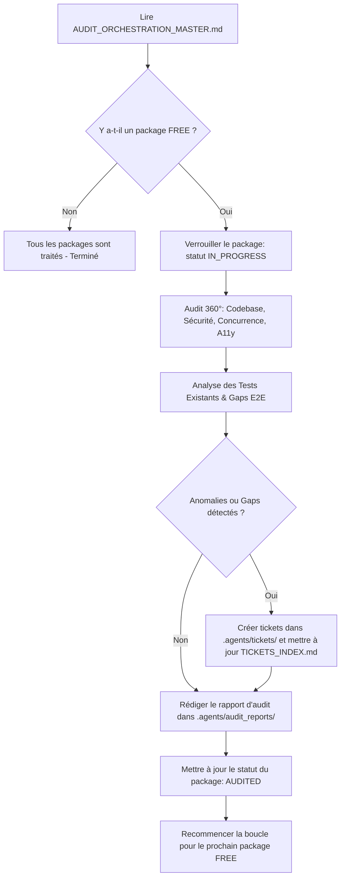

# OmniAntigravity Remote Chat 360° Audit Squad — Fichier Maître d'Orchestration & Coordination des Agents

> **Document central et source unique de vérité pour la coordination des audits applicatifs.**
> Ce fichier régit le découpage en packages, le protocole de verrouillage anti-collision entre agents, la méthodologie d'évaluation 360°, le système de tickets et la vérification de complétude des tests E2E.

---

## 🧭 Sommaire

1. [Règles Générales & Protocole d'Exécution](#1-règles-générales--protocole-dexécution)
2. [Procédure Opératoire Standard (SOP) pour Chaque Agent](#2-procédure-opératoire-standard-sop-pour-chaque-agent)
3. [Tableau de Bord & Verrouillage des Packages (Registre Temps Réel)](#3-tableau-de-bord--verrouillage-des-packages-registre-temps-réel)
4. [Catalogue Exhaustif des 15 Packages de Domaine](#4-catalogue-exhaustif-des-15-packages-de-domaine)
5. [Méthodologie d'Audit 360° & Grille d'Évaluation](#5-méthodologie-daudit-360-grille-dévaluation)
6. [Système de Tickets & Rapports d'Amélioration](#6-système-de-tickets--rapports-damélioration)
7. [Prompts de Démarrage Prêts à l'Emploi pour les Sous-Agents](#7-prompts-de-démarrage-prêts-à-lemploi-pour-les-sous-agents)

---

## 1. Règles Générales & Protocole d'Exécution

1. **Autonomie des Packages** : Chaque package correspond à un domaine fonctionnel et architectural précis. Un agent audite **un seul package à la fois**.
2. **Capacité Parallèle Anti-Collision** : Jusqu'à 4 agents (`Agent-1` à `Agent-4` ou `OmniAuditor`) peuvent opérer simultanément grâce au protocole de verrouillage (§2 et §3).
3. **Traçabilité & Immutabilité** : Tout ticket créé reçoit un identifiant immuable `TICKET-DOMXX-YYY` consigné dans [.agents/tickets/TICKETS_INDEX.md](file:///.agents/tickets/TICKETS_INDEX.md).
4. **Conformité aux Règles du Projet** :
   - Respecter la convention ESM native (`"type": "module"`, aucun `require`).
   - Préserver l'étanchéité des CSP et de la politique de sécurité des cookies `omni_ag_auth`.
   - Ne jamais introduire de fuites de sous-processus (`child_process`).
   - Assurer la conformité responsive et tactile de l'UI mobile (A11y, ARIA, focus trap).

---

## 2. Procédure Opératoire Standard (SOP) pour Chaque Agent

Tout agent exécutant l'audit doit suivre scrupuleusement la boucle opérationnelle suivante :



### Étape 1 : Réservation Atomique du Package (Locking)
1. Ouvrir ce fichier `AUDIT_ORCHESTRATION_MASTER.md`.
2. Repérer dans le tableau du [§3](#3-tableau-de-bord--verrouillage-des-packages-registre-temps-réel) le premier package dont le statut est **`FREE`**.
3. Remplacer immédiatement son statut par :
   `🔄 IN_PROGRESS`
   et renseigner la colonne `Agent Assigné` avec votre identifiant (ex: `OmniAuditor`) et la date/heure de prise en charge.
4. Sauvegarder le fichier. Le package est verrouillé.

### Étape 2 : Analyse 360° du Domaine
1. Examiner les fichiers source assignés au package (§4).
2. Vérifier les 6 dimensions : Architecture, Sécurité/Auth, Concurrence/Asynchronisme, Ergonomie/A11y, Observabilité/Erreurs, et Couverture de tests.
3. Pour chaque anomalie ou manque de test identifié :
   - Créer une fiche ticket dans `.agents/tickets/TICKET-[DOMXX]-[YYY]-[slug].md` selon [TICKET_TEMPLATE.md](file:///.agents/tickets/TICKET_TEMPLATE.md).
   - Inscrire la ligne correspondante dans [.agents/tickets/TICKETS_INDEX.md](file:///.agents/tickets/TICKETS_INDEX.md).

### Étape 3 : Production du Rapport & Clôture
1. Créer le rapport détaillé `.agents/audit_reports/AUDIT_REPORT_DOM[XX]_[slug].md` selon [AUDIT_REPORT_TEMPLATE.md](file:///.agents/audit_reports/AUDIT_REPORT_TEMPLATE.md).
2. Calculer la scorecard 360° et récapituler les tickets levés.
3. Mettre à jour ce tableau de bord : passer le statut en `✅ AUDITED`, renseigner la date de fin, le nombre de tickets et le lien vers le rapport.

---

## 3. Tableau de Bord & Verrouillage des Packages (Registre Temps Réel)

| ID Package | Domaine Fonctionnel | Périmètre Principal | Statut | Agent Assigné | Début | Fin | Tickets Levés | Rapport d'Audit |
|---|---|---|:---:|:---:|:---:|:---:|:---:|:---:|
| **PKG-01** | Connexion CDP, Multi-fenêtres & Cycle Antigravity | `src/cdp/connection.js`, `src/utils/process.js` | `✅ AUDITED` | OmniAuditor | 2026-09-15 22:55 | 2026-09-15 23:05 | 3 tickets (1 P1, 2 P2) | [Rapport DOM01](file:///.agents/audit_reports/AUDIT_REPORT_DOM01_connexion_cdp.md) |
| **PKG-02** | Messagerie, Concurrence & Verrou Send-Lock | `src/server.js` (`/send`, `/stop`, `withSendLock`) | `✅ AUDITED` | OmniAuditor | 2026-09-15 22:55 | 2026-09-15 23:08 | 3 tickets (2 P1, 1 P2) | [Rapport DOM02](file:///.agents/audit_reports/AUDIT_REPORT_DOM02_messagerie_sendlock.md) |
| **PKG-03** | Éditeur Lexical, Staging & Injection de Commandes | DOM Lexical, dispatch touches, boundary staging | `✅ AUDITED` | OmniAuditor | 2026-09-15 22:56 | 2026-09-15 23:10 | 2 tickets (1 P1, 1 P2) | [Rapport DOM03](file:///.agents/audit_reports/AUDIT_REPORT_DOM03_editeur_lexical.md) |
| **PKG-04** | Questions Interactives (`ask_question`), Grill-Me | `src/server.js`, `/api/interact-action` | `✅ AUDITED` | OmniAuditor | 2026-09-15 22:57 | 2026-09-15 23:12 | 2 tickets (1 P1, 1 P2) | [Rapport DOM04](file:///.agents/audit_reports/AUDIT_REPORT_DOM04_questions_approbations.md) |
| **PKG-05** | Snapshot Polling, Hash Djb2 & Diffusion WebSocket | `src/utils/hash.js`, `src/server.js`, WS broadcast | `✅ AUDITED` | OmniAuditor | 2026-09-15 22:58 | 2026-09-15 23:14 | 2 tickets (1 P1, 1 P2) | [Rapport DOM05](file:///.agents/audit_reports/AUDIT_REPORT_DOM05_snapshot_websocket.md) |
| **PKG-06** | Authentification, Contrôle d'Accès & Sécurité Réseau | `src/utils/network.js`, `src/config.js`, middleware auth | `✅ AUDITED` | OmniAuditor | 2026-09-15 22:58 | 2026-09-15 23:18 | 4 tickets (2 P0, 1 P1, 1 P2) | [Rapport DOM06](file:///.agents/audit_reports/AUDIT_REPORT_DOM06_auth_securite.md) |
| **PKG-07** | Espace de Travail Distant (Terminal, Fichiers, Git) | `src/utils/workspace.js`, `/api/fs/*`, `/api/terminal/*` | `✅ AUDITED` | OmniAuditor | 2026-09-15 22:59 | 2026-09-15 23:20 | 3 tickets (1 P0, 1 P1, 1 P2) | [Rapport DOM07](file:///.agents/audit_reports/AUDIT_REPORT_DOM07_workspace_remote.md) |
| **PKG-08** | Téléchargement & Traitement Multimédia (Images/Audio) | `/api/upload-image`, `/api/upload-audio`, WebP | `✅ AUDITED` | OmniAuditor | 2026-09-15 23:00 | 2026-09-15 23:22 | 2 tickets (1 P1, 1 P2) | [Rapport DOM08](file:///.agents/audit_reports/AUDIT_REPORT_DOM08_multimedia_uploads.md) |
| **PKG-09** | Surveillance des Quotas & Découverte Language Server | `src/quota-service.js`, `/api/quota` | `✅ AUDITED` | OmniAuditor | 2026-09-15 23:01 | 2026-09-15 23:24 | 2 tickets (1 P2, 1 P3) | [Rapport DOM09](file:///.agents/audit_reports/AUDIT_REPORT_DOM09_quotas_languageserver.md) |
| **PKG-10** | Timeline de Captures d'Écran & Archivage Disque | `src/screenshot-timeline.js`, `/api/timeline/*` | `✅ AUDITED` | OmniAuditor | 2026-09-15 23:02 | 2026-09-15 23:25 | 2 tickets (1 P1, 1 P2) | [Rapport DOM10](file:///.agents/audit_reports/AUDIT_REPORT_DOM10_timeline_screenshots.md) |
| **PKG-11** | Superviseur IA & File de Suggestions (OmniRoute) | `src/supervisor.js`, `/api/suggestions/*`, `/api/assist/*` | `✅ AUDITED` | OmniAuditor | 2026-09-15 23:02 | 2026-09-15 23:27 | 2 tickets (1 P1, 1 P2) | [Rapport DOM11](file:///.agents/audit_reports/AUDIT_REPORT_DOM11_superviseur_omniroute.md) |
| **PKG-12** | Bot Telegram & Notifications Déportées | `src/utils/telegram.js`, `/status`, `/approve`, rate limit | `✅ AUDITED` | OmniAuditor | 2026-09-15 23:03 | 2026-09-15 23:28 | 2 tickets (1 P2, 1 P3) | [Rapport DOM12](file:///.agents/audit_reports/AUDIT_REPORT_DOM12_telegram_bot.md) |
| **PKG-13** | Tunnels Distants, SSL & Déploiement Hybride | `scripts/cloudflare-tunnel.js`, `scripts/pinggy-tunnel.js` | `✅ AUDITED` | OmniAuditor | 2026-09-15 23:04 | 2026-09-15 23:30 | 2 tickets (1 P1, 1 P2) | [Rapport DOM13](file:///.agents/audit_reports/AUDIT_REPORT_DOM13_tunnels_ssl.md) |
| **PKG-14** | Frontend Mobile, Ergonomie Tactile, Thèmes & PWA | `public/index.html`, `public/js/app.js`, `public/sw.js` | `✅ AUDITED` | OmniAuditor | 2026-09-15 23:04 | 2026-09-15 23:32 | 3 tickets (1 P1, 2 P2) | [Rapport DOM14](file:///.agents/audit_reports/AUDIT_REPORT_DOM14_frontend_pwa.md) |
| **PKG-15** | Panneau d'Administration, Métriques & Observabilité | `public/admin.html`, `public/js/admin.js`, `/api/admin/*` | `✅ AUDITED` | OmniAuditor | 2026-09-15 23:05 | 2026-09-15 23:34 | 2 tickets (1 P2, 1 P3) | [Rapport DOM15](file:///.agents/audit_reports/AUDIT_REPORT_DOM15_admin_metriques.md) |

---

## 4. Catalogue Exhaustif des 15 Packages de Domaine

### PKG-01 — Domaine 1 : Connexion CDP, Multi-fenêtres & Cycle Antigravity
- **Fichiers Clés** : `src/cdp/connection.js`, `src/utils/process.js`, `src/server.js` (endpoints `/cdp-targets`, `/select-target`, `/api/launch-window`, `/app-state`).
- **Focus 360°** : Robustesse de découverte sur ports 7800-7803, reconnexion automatique en cas de crash Antigravity, gestion du contexte `targetId`, réassignation dynamique des listeners WebSocket CDP.

### PKG-02 — Domaine 2 : Messagerie, Concurrence & Verrou Send-Lock
- **Fichiers Clés** : `src/server.js` (méthodes `withSendLock`, `sendPrompt`, routes `/send`, `/stop`), `test/unit/send-lock.test.js`.
- **Focus 360°** : Déduplication SHA-256 des requêtes concurrentes, libération garantie du verrou dans le bloc `finally`, prévention du double-clic mobile, backoff exponentiel lors des retours 'busy'.

### PKG-03 — Domaine 3 : Éditeur Lexical, Staging & Injection de Commandes
- **Fichiers Clés** : `src/server.js` (fonctions d'injection Lexical, dispatch de frappe de touches, création de paragraphes DOM).
- **Focus 360°** : Support des retours à la ligne (`Shift+Enter`), validation des limites d'entrée de saisie (`boundary staging`), tolérance aux mutations internes de l'éditeur Antigravity/VS Code.

### PKG-04 — Domaine 4 : Questions Interactives (`ask_question`), Grill-Me & Approbations
- **Fichiers Clés** : `src/server.js` (`/api/interact-action`, `/api/action/respond`), `src/supervisor.js`, `test/unit/action-decision.test.js`.
- **Focus 360°** : Interception fiable des dialogues de décision (`ask_question`), badges d'options illuminés, persistance de la suppression de plans déjà exécutés, verrou de grâce anti-bouclage.

### PKG-05 — Domaine 5 : Snapshot Polling, Hash Djb2 & Diffusion WebSocket
- **Fichiers Clés** : `src/server.js` (`startSnapshotPolling`), `src/utils/hash.js`, `public/js/vendor/morphdom-lite.js`.
- **Focus 360°** : Détection des deltas DOM via djb2, limitation de bande passante sur réseau mobile, minimisation des reflows client, résilience aux déconnexions transitoires.

### PKG-06 — Domaine 6 : Authentification, Contrôle d'Accès & Sécurité Réseau
- **Fichiers Clés** : `src/utils/network.js` (`isLocalRequest`), `src/config.js`, `src/server.js` (middleware auth, cookies signés, CSP).
- **Focus 360°** : Faille de bypass LAN sur plages IP publiques `172.x`, protection contre les attaques par timing sur `APP_PASSWORD`, validation de session persistante sur reboot, exhaustivité de protection des 60+ routes.

### PKG-07 — Domaine 7 : Espace de Travail Distant (Terminal, Fichiers, Git)
- **Fichiers Clés** : `src/utils/workspace.js`, `/api/fs/*`, `/api/terminal/*`, `/api/git/*`.
- **Focus 360°** : Prévention de l'évasion de workspace via liens symboliques (`fs.realpath`), terminaison propre des processus enfants (arborescence process-group) évitant les processus zombies.

### PKG-08 — Domaine 8 : Téléchargement & Traitement Multimédia (Images/Audio)
- **Fichiers Clés** : `src/server.js` (`/api/upload-image`, `/api/upload-audio`), `data/uploads/`.
- **Focus 360°** : Validation des types MIME audio/image, plafond strict de taille (15MB), nettoyage périodique du disque, transfert dans le presse-papiers CDP Antigravity.

### PKG-09 — Domaine 9 : Surveillance des Quotas & Découverte Language Server
- **Fichiers Clés** : `src/quota-service.js`, `/api/quota`.
- **Focus 360°** : Détection non-bloquante du binaire `language_server`, gestion des certificats auto-signés HTTPS, cache local TTL, absence de crash en cas d'indisponibilité du service.

### PKG-10 — Domaine 10 : Timeline de Captures d'Écran & Archivage Disque
- **Fichiers Clés** : `src/screenshot-timeline.js`, `/api/timeline/*`.
- **Focus 360°** : Persistance atomique de `manifest.json`, purge FIFO automatique selon le quota configuré, détection différentielle évitant les captures redondantes.

### PKG-11 — Domaine 11 : Superviseur IA & File de Suggestions (OmniRoute)
- **Fichiers Clés** : `src/supervisor.js`, `/api/suggestions/*`, `/api/assist/*`.
- **Focus 360°** : Barrières heuristiques bloquant les commandes destructrices (`rm -rf`, modification de configs critiques), respect des quotas API, robustesse en mode déconnecté.

### PKG-12 — Domaine 12 : Bot Telegram & Notifications Déportées
- **Fichiers Clés** : `src/utils/telegram.js`.
- **Focus 360°** : Chargement paresseux (`lazy-load`) sans crash si non installé, limitation de débit (`rate-limiting`), validation des actions de callback inline (`approve`/`reject`).

### PKG-13 — Domaine 13 : Tunnels Distants, SSL & Déploiement Hybride
- **Fichiers Clés** : `scripts/cloudflare-tunnel.js`, `scripts/pinggy-tunnel.js`, `launcher.js`, `scripts/setup-ssl.js`.
- **Focus 360°** : Bascule automatique en cas d'échec de tunnel, génération sécurisée des certificats SSL locaux, détection d'environnement WSL2.

### PKG-14 — Domaine 14 : Frontend Mobile, Ergonomie Tactile, Thèmes & PWA
- **Fichiers Clés** : `public/index.html`, `public/js/app.js`, `public/sw.js`, `public/css/*`.
- **Focus 360°** : Ergonomie mobile (zones de frappe >= 48px), adaptation au clavier virtuel sans masquer la saisie, mise en cache PWA et mode lite dégradé (`minimal.html`).

### PKG-15 — Domaine 15 : Panneau d'Administration, Métriques & Observabilité
- **Fichiers Clés** : `public/admin.html`, `public/js/admin.js`, `/api/admin/*`, `src/session-stats.js`.
- **Focus 360°** : Isolation de l'accès administrateur, streaming des logs serveur, calcul fidèle des compteurs d'approbations et d'erreurs.

---

## 5. Méthodologie d'Audit 360° & Grille d'Évaluation

Pour chaque domaine, attribuer une note de 1 à 5 étoiles :
- **5/5 (Excellent)** : Aucune faille, résilience prouvée, tests automatisés complets.
- **4/5 (Bon)** : Code robuste, quelques pistes d'optimisation mineures ou tests à compléter.
- **3/5 (Moyen)** : Fonctionnel mais lacunes de validation, manque de tests sur cas d'erreur.
- **2/5 (Fragile)** : Risques avérés de concurrence, d'incohérence d'état ou absence de tests E2E.
- **1/5 (Critique)** : Faille de sécurité majeure, risque d'injection, fuite de processus ou blocage total.

---

## 6. Système de Tickets & Rapports d'Amélioration

Tous les tickets créés sont répertoriés dans :
- Index : [.agents/tickets/TICKETS_INDEX.md](file:///.agents/tickets/TICKETS_INDEX.md)
- Fiches de tickets : `.agents/tickets/TICKET-[DOMXX]-[YYY]-[slug].md`
- Rapports : `.agents/audit_reports/AUDIT_REPORT_DOM[XX]_[slug].md`

---

## 7. Prompts de Démarrage Prêts à l'Emploi pour les Sous-Agents

```text
Tu es l'Agent Auditeur assigné au package [PKG-XX] d'OmniAntigravityRemoteChat.
Consulte AUDIT_ORCHESTRATION_MASTER.md et prends en charge le package en le passant en IN_PROGRESS.
Exécute l'audit 360° approfondi sur les fichiers clés du domaine.
Génère les fiches d'anomalies dans .agents/tickets/ selon TICKET_TEMPLATE.md.
Mets à jour TICKETS_INDEX.md et rédige le rapport complet dans .agents/audit_reports/.
Clôture le package en passant son statut à AUDITED dans le tableau de bord.
```
